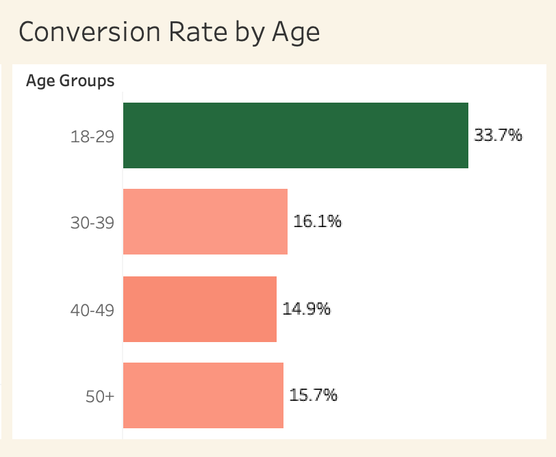
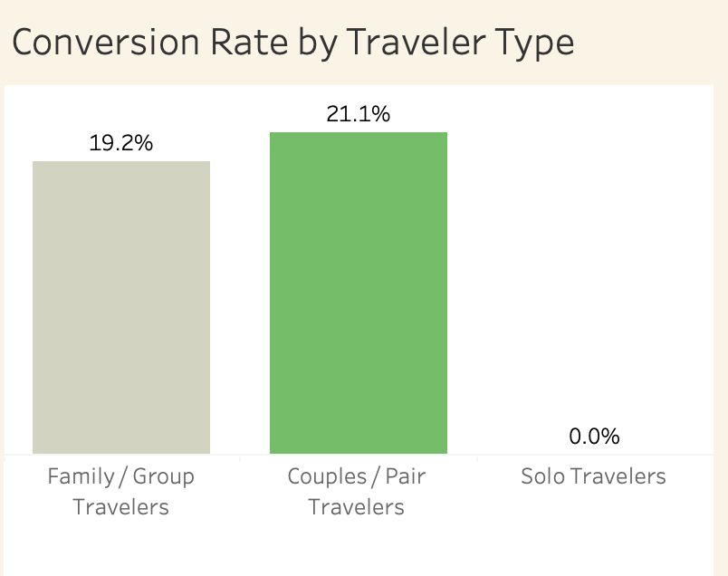
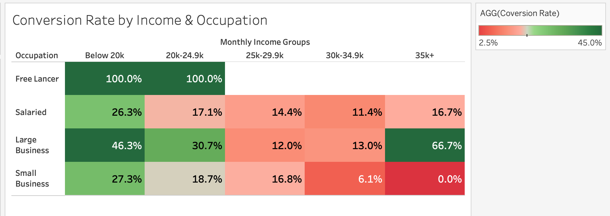
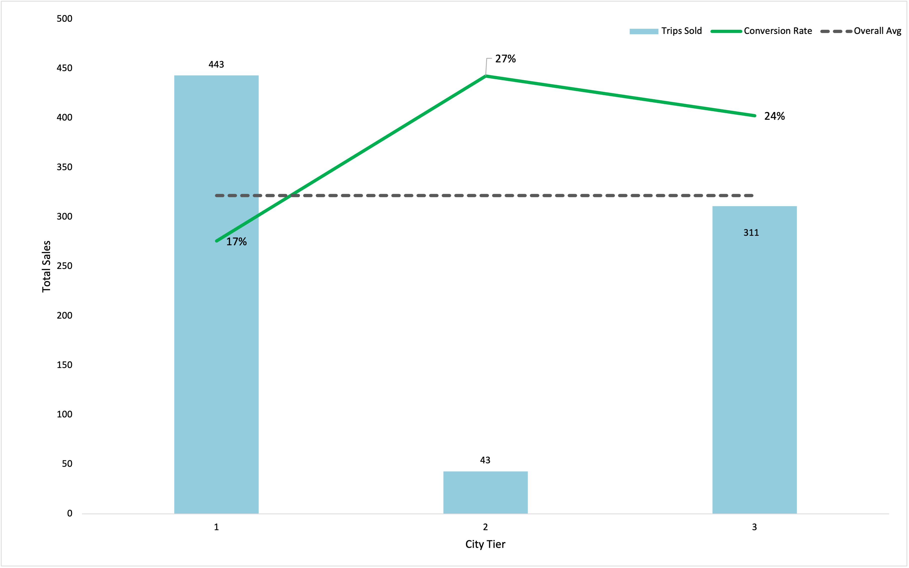
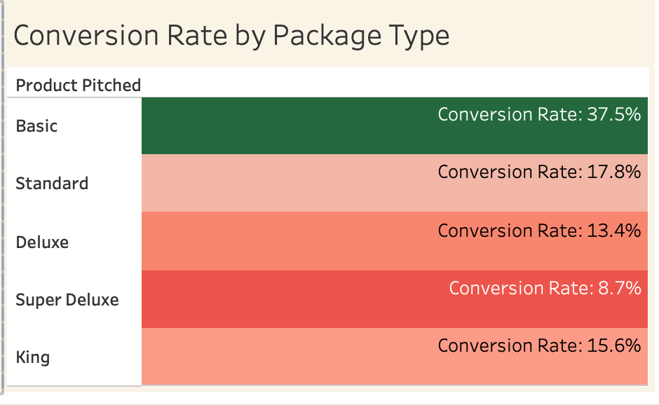

# Sales & Marketing Conversion Analysis: Optimizing Travel Package Sales

## Project Overview

This project analyzes customer, sales, and marketing data for a tourism company seeking to improve travel package conversion. The company wants to better understand which customer segments are most likely to purchase after being pitched, where sales efforts are most effective, and how marketing strategy can be adjusted to improve package sales.

The analysis focuses on conversion rate as the primary success metric as an indicator of whether a customer purchased a travel package after being pitched.

---

## Business Problem

The company’s overall conversion rate is 19.3%, meaning fewer than one in five customers purchase a travel package after being pitched. While some customer segments convert above average, several large and strategically important groups underperform.

The goal of this project is to identify:

- Which customer segments convert above or below average
- Which groups represent the largest sales growth opportunities
- Where the company should focus short-term marketing efforts
- How the company can redesign pitch strategies for underperforming segments

---

## Executive Summary

The company should scale high-converting customer segments in the short term while redesigning pitches for underperforming high-volume and high-value segments.

Conversion is strongest among younger customers, couples/pair travelers, lower-income groups, and Tier 3 cities, showing where the current sales strategy is working. However, larger segments such as 30+ customers, family/group travelers, higher-income customers, and Tier 1 cities show below-average conversion or missed upside.

The recommended strategy is to scale what works, fix what underperforms, and use test markets to evaluate revised marketing strategies. Short-term campaigns should focus on responsive customer segments, while revised pitches should be tested for groups with lower conversion but larger potential impact.

---

## Key Business Questions

1. Who is most likely to purchase a travel package after being pitched?
2. Which traveler profiles make up the largest share of customers?
3. How does conversion vary across age, income, occupation, city tier, and package type?
4. Are higher-income customers actually more likely to convert?
5. Which customer segments should the company prioritize for marketing and sales optimization?

---

## KPIS
| Metric | Purpose |
|---|---|
| **Conversion Rate** | Measures the percentage of customers who purchased after being pitched |
| **Trips Sold** |Counts total packages purchased |
| **Total Customers** | Measures segment size and sample reliability |
| **Customer Share** | Shows how much each segment contributes to the customer base |

---

### Dashboard Overview

**Tableau Dashboard:** 
<noscript></noscript><object class='tableauViz'  style='display:none;'><param name='host_url' value='https%3A%2F%2Fpublic.tableau.com%2F' /> <param name='embed_code_version' value='3' /> <param name='site_root' value='' /><param name='name' value='ProductMarketing_17794131190710&#47;Dashboard1' /><param name='tabs' value='no' /><param name='toolbar' value='yes' /><param name='static_image' value='https:&#47;&#47;public.tableau.com&#47;static&#47;images&#47;Pr&#47;ProductMarketing_17794131190710&#47;Dashboard1&#47;1.png' /> <param name='animate_transition' value='yes' /><param name='display_static_image' value='yes' /><param name='display_spinner' value='yes' /><param name='display_overlay' value='yes' /><param name='display_count' value='yes' /><param name='language' value='en-US' /></object>
                

---
## Key Findings

### 1. Younger customers are the strongest short-term conversion opportunity

Customers aged 18–29 converted at approximately 34%, above the average of 19.3%. This group also contributed roughly 35% of total sales across age groups, making them both highly responsive and commercially meaningful.

However, customers aged 30+ convert below average. A scenario analysis showed that raising 30+ customers to the company average conversion rate could generate an estimated 14% lift in total package sales.

Suggested visual:

Business implication:  
The current pitch resonates most strongly with younger customers. The company should maintain youth-focused campaigns while testing revised messaging for older customers.

---

### 2. Family/group travelers dominate the customer base, but couples/pairs convert more effectively

Family/group travelers make up nearly 87% of total customers, making them the largest customer segment. However, couples/pair travelers convert at approximately 21%, outperforming family/group travelers despite representing only about 13% of the customer base.

A scenario analysis showed that if family/group travelers matched the couples/pairs conversion rate, total package sales could increase by approximately 8%, equal to roughly 64 additional packages sold.

Suggested visual:

Business implication:  
Couples/pairs are a strong short-term target, but family/group travelers represent the largest improvement opportunity because of their scale.

---

### 3. Higher-income customers struggle to convert

Lower-income and lower-to-mid income groups showed stronger conversion across several occupations, while higher-income groups converted below average.

This challenges the assumption that higher-income customers are automatically the best target. The current pitch may be more effective for value-sensitive customers but less convincing for customers expecting premium travel experiences.

Suggested visual:

Business implication:  
The company should maintain value-focused messaging for responsive lower-income customers while testing premium positioning for higher-income segments around exclusivity, flexibility, convenience, and upgraded travel experiences.

Note:  
Very high conversion rates in small segments, such as freelancers, should be interpreted cautiously due to very low customer counts thus being unreliable.

---

### 4. Tier 1 cities drive volume, but Tier 3 cities convert more efficiently

Tier 1 cities generated the most trips sold, with 443 purchases, largely because they contain the largest customer base. However, Tier 1 conversion was below average.

Tier 3 cities produced 311 trips sold with a stronger conversion rate of approximately 24%. Tier 2 cities had the highest conversion rate at around 27%, but only represented about 4% of customers, making it a smaller test market rather than a primary growth focus.

Suggested visual:

Business implication:  
The company should maintain Tier 3 performance, improve pitch effectiveness in Tier 1 cities, and use Tier 2 cities as a smaller test market for revised marketing strategies.

---

### 5. Package type analysis can support pitch redesign

Package-level conversion showed that some package types perform better than others, with Basic packages converting strongest. Higher-tier packages such as Deluxe, Super Deluxe, or King appear to require stronger value justification.

Suggested visual:

Business implication:  
The company should test whether higher-tier packages need different positioning, such as emphasizing upgraded experiences, exclusivity, flexible travel options, or premium service benefits.
